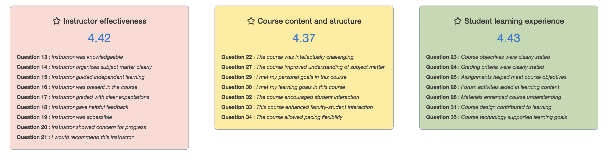
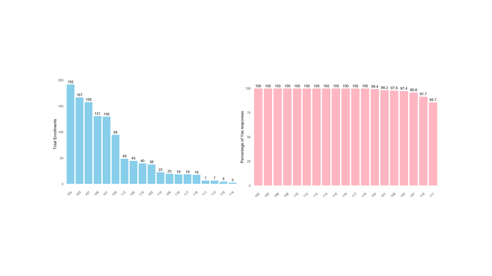
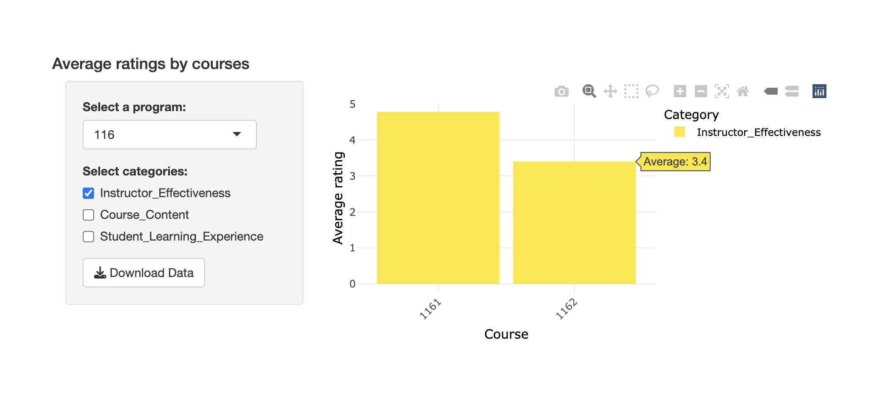
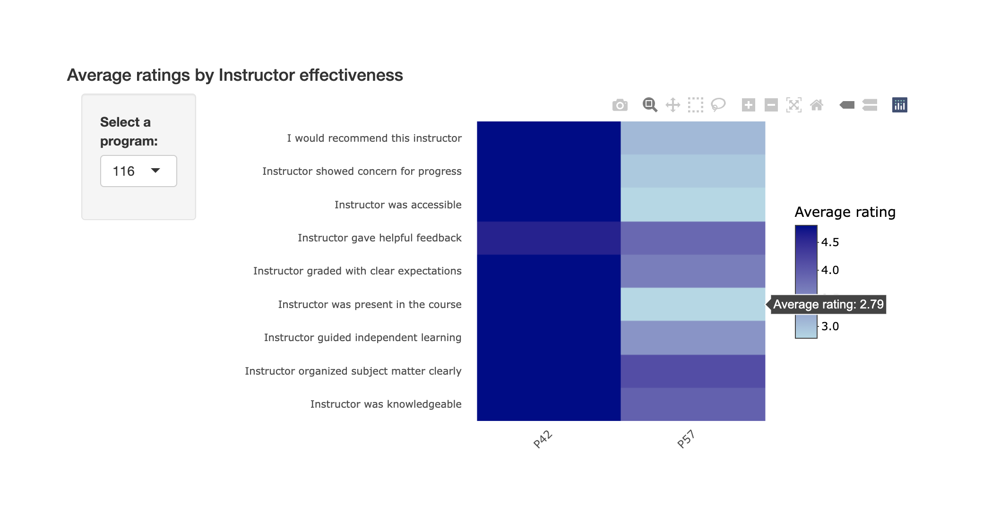
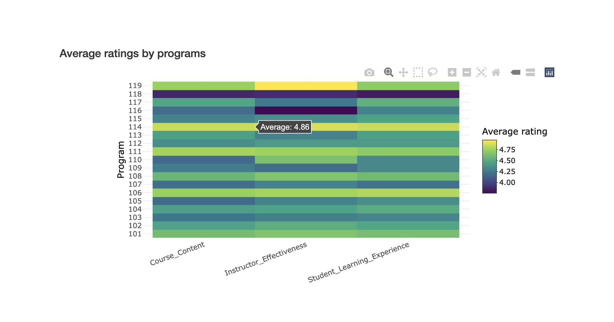
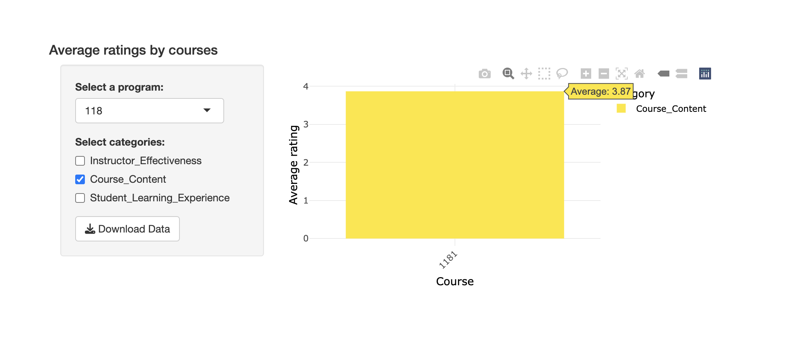
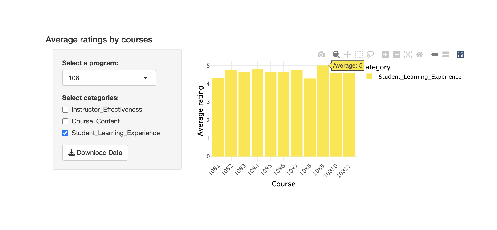

# Project Background

McDaniel College, a private liberal arts college founded in 1867, is focused on delivering a top-notch, student-centered education through its undergrad, grad, and certificate programs. The Graduate and Professional Studies division helps fuel McDaniel’s growth by attracting students looking to advance in fields like education, business, and healthcare. To keep a competitive edge and improve student experience, McDaniel values student feedback on courses, instructors, and program structure. As a volunteer data analyst, I’m supporting my professor by analyzing this feedback, identifying trends, and highlighting areas for improvement. My work will inform insights that my professor can present to the Dean to drive data-backed improvements in the graduate programs. 

Insights and recommendations are provided on the following key areas: 
- Enrollment trends
- Instructor effectiveness
- Course content and structure
- Student learning experience
- Course duration impact

The R code used for data cleaning, analysis, and visualization of course-related information is available [here](allprog.Rmd). 

A PDF copy of the interactive visualizations can also be found [here](Feedback-Navigator.pdf). However, the actual dataset and output files are not publicly shared due to the sensitive nature of student feedback on instructors and courses.

# Data Structure & Initial Checks

Over 1,000 records of student feedback were collected across 19 Graduate and Professional programs, comprising 36 columns of quantitative and qualitative feedback. Program and course information were anonymized for security.
- Numerical data had no missing values, as they were required fields during feedback collection. Rating data (Questions 13 to 35) was provided on a scale of 1 (Strongly Disagree) to 5 (Strongly Agree).
- Qualitative data was cleaned to standardize variations of missing values (e.g., "Na," "N/a," "n/A") to <NA>.
- Questions were categorized into three groups for better visualization, and qualitative analysis of Question 8 feedback was conducted to identify themes for course improvement.

# Executive Summary

### Overview of findings

In summer 2024, the overall average rating across all course-related questions was above 4, indicating general student satisfaction with course content. However, Question 33, which addresses faculty-student interaction, had the lowest average score at 4.13, highlighting potential for improvement in engagement. Additionally, Program 118 consistently received low scores (below 4) across all categories, and certain instructors, particularly P57 in Program 116, received ratings below 3 on effectiveness-related questions, signalling specific areas that warrant attention.

# Insights Deep Dive

## Enrollments trends
- Program 104 leads with the highest enrollment (192 students), while programs like 111, 113, 114, and 119 have fewer than 10 students.
- Fewer than 50 students enrolled in most programs except for 101, 103, 104, 107, 108, and 109.
- Most students (100%) agreed they could preview the course structure a week before the start date, with exceptions in programs 101, 103, 104, 107, 108, 111, and 118.
  
  

## Instructor effectiveness

-	Students rated several instructors (e.g., P12, P69, P68, P87, P82) a perfect 5 across all effectiveness-related questions.
  
  

-	The average rating for Question 13 (instructor knowledge) is 4.56, with all other instructor-related questions averaging above 4.
  
  

-	Program 119 achieved the highest average (4.97) for "Instructor Effectiveness," while Program 1162 scored the lowest (3.4).
  
  

-	Specific instructors (P57 from Program 116, P51 from Program 109, P85 from Program 104) received ratings below 3 on certain questions in this category.
  
  

## Course content and structure
-	Course 1141 from Program 114 had the highest rating (4.86) in this category, with positive feedback except for the last two weeks.

 	 

-	Course 1181 from Program 118 scored the lowest (3.87), with concerns about course organization and clarity of assignment expectations.

 	
 	

## Students learning experience
-	Courses 1089 from Program 108 and 1111 from Program 111 scored high (4.9–5) in student learning experience.
  
  

-	Courses such as 1036, 1038, and 10313 from Program 103 received low ratings, with concerns about assignment overload, outdated learning materials, and Blackboard organization.

 	

- Several courses showed lower average ratings, including 1181 (3.82) from Program 118, 1121 (3.76) from Program 112, 1096 (3.35) from Program 109, 1072 (3.8) from Program 107, 1054 (3.84) from Program 105, and 10415 (3.52) from Program 104. These ratings highlight potential issues that warrant further investigation. Cross-verifying qualitative comments from these courses could provide deeper insights into the reasons behind the lower scores, such as assignment overload, unclear expectations, or other student concerns.

## Course duration impact
-	Course 1096 from Program 109 (6 weeks) had an average rating of 3.13, with feedback highlighting issues with the instructor and overall student dissatisfaction.

 	

-	Students from the course 1181 rated an average of 3.86 regarding course duration (8 weeks). Students from course 1072 from program 107 rated an average of 3.84 about their course duration (6 weeks). 

# Recommendations

Based on the insights and findings above, we would recommend the Dean of Graduate and Professional Studies to consider the following:

- Address low-enrollment programs: Evaluate programs with fewer than 10 students (e.g., Programs 111, 113, 114, 119) for sustainability. Consider targeted marketing or curriculum updates to increase enrollment.
- Ensure consistent course previews: Standardize the availability of course previews a week before the start date across all programs, addressing gaps in Programs 101, 103, 104, 107, 108, 111, and 118.
- Support instructors with low ratings: Offer professional development and mentorship to instructors in programs with low ratings (e.g., P57 in Program 116 and Program 1162 overall). Focus on addressing student concerns for improved effectiveness.
- Improve course structure and clarity: Revamp courses like 1181 (Program 118) by enhancing course organization and clarity of assignment expectations to address concerns about content and structure.
- Enhance student learning experience: Streamline assignments, update outdated materials, and improve Blackboard usability for courses with low ratings (e.g., 1036, 1038, 10313 from Program 103).
- Reassess course duration: Evaluate the pacing and workload of short-duration courses like 1096 (6 weeks, Program 109) and 1181 (8 weeks, Program 118). Consider feedback on whether alternative formats or adjusted pacing would better meet student needs.

